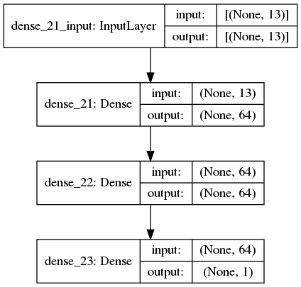

# Predicting house prices: a regression example

We'll attempt to predict the median price of homes in a given Boston suburb
in the mid-1970s, given data points about the suburb at the time, such as the
crime rate, the local property tax rate, etc. 
We predict a continuous value instead of a discrete label, 
which is a common type of machine learning problem called regression.

## Net architecture for predicting house prices

